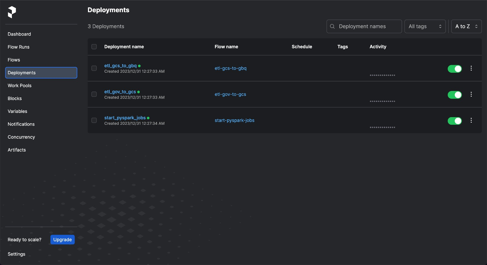

# Covid-19 Patient Impact & Hospital Utilization Analytics

The COVID-19 Patient Impact and Hospital Capacity Analysis project aims to investigate and analyze the available COVID-19 patient data and hospital capacity metrics from the Healthdata.gov [dataset](https://healthdata.gov/Hospital/COVID-19-Reported-Patient-Impact-and-Hospital-Capa/uqq2-txqb). This data analysis initiative intends to identify trends, patterns, and insights related to COVID-19 patient admissions, resource utilization, and hospital capacity.

## Technologies

During the development of this project, the various technologies utilized were:

1. Google Cloud Storage: was used as the data lake
2. Google BigQuery: was used as the data warehouse
3. Google Dataproc: for executing spark jobs
4. Google Looker Studio: for building an interactive dashboard
5. Google Cloud Compute: for hosting a private instance of Prefect
6. Terraform: for provisioning the resources on Google Cloud

### Project Structure

This project contains the following directories:

- `images`: contains all the screenshots captured for writing this readme
- `infra`: contains all the Terraform scripts needed to provision resources on Google Cloud
- `prefect`: contains all the Prefect jobs and configurations
- `pyspark`: contains all the Spark jobs used for building dimension tables
- `schemas`: contains the JSON representation of the tables created in Google BigQuery
- `scripts`: contains some handy scripts to make setting up the Prefect server a breeze.

## Architecture

## Setting up the Infrastructure

The traditional methods of building the above architecture in Google Cloud using console UI, gcloud CLI, or REST API are time-consuming and error-prone, especially when it comes to scaling infrastructure. To address this, I used Terraform to provision and decommission infrastructure in a more efficient and manageable way. Terraform is an infrastructure as code (IaC) tool that automates the provisioning of infrastructure resources, allowing for easier management at scale. It is a good choice even for small projects as it allows for cost reduction by destroying cloud resources once the project is completed.

## Workflow

The workflow for this project consists of several stages. Initially, the dataset is fetched from the source, after which it is loaded into Google BigQuery. Following this, dimension tables are created by performing various transformations on the raw dataset using PySpark. Finally, an interactive dashboard is built using the dimension tables, enabling users to analyze and visualize the data in a meaningful way.

### Orchestration

To orchestrate all the tasks in the workflow, Prefect was chosen. Prefect is a modern data workflow management system that allows for the creation, scheduling, and monitoring of complex data pipelines. It offers features such as error handling, task retries, and dynamic dependencies, making it an ideal choice for data engineering projects. Additionally, Prefect integrates seamlessly with various cloud platforms, including Google Cloud, which was used for this project. By using Prefect, I was able to create a reliable and scalable workflow that automates the various tasks involved in processing the dataset and building the dashboard.

The sequence of manual task execution:

1. etl_gcs_to_gbq.py
2. etl_gov_to_gcs.py
3. start_pyspark_jobs.py

**Deployments**

**Flows**

**Flow Runs**

#### Configuration

To simplify the sharing of information among flows, I utilized Prefect blocks to securely and easily manage the configuration related to my project. Prefect blocks are reusable building blocks that allow for the creation of modular, shareable, and easily configurable code. These blocks encapsulate specific functionality and are used to create more complex flows. They can also be parameterized to allow for easy configuration and reuse. In my project, I used Prefect blocks to store the necessary credentials for accessing my Google Cloud services, making it easier to maintain and manage this sensitive information.

### Data Lake

In the workflow of this project, the dataset is initially fetched from Kaggle and stored in a bucket in Google Cloud Storage, which serves as a data lake. A data lake is a centralized repository that allows for the storage of structured and unstructured data in its native format. Google Cloud Storage is a great choice for a data lake because of its durability, scalability, and low cost. Additionally, it seamlessly integrates with other Google Cloud services such as BigQuery, which is used as the data warehouse in this project.

### Data Warehouse

After the data has been stored in the data lake, the Prefect job `etl_gcs_to_gbq` creates a new table in BigQuery named `raw_data`. A data warehouse is a central repository of structured, processed, and cleansed data that is optimized for analytical queries and reporting. It is designed to support business intelligence (BI) and decision-making processes by providing a consistent and reliable source of data. Google BigQuery is a good choice for a data warehouse because it provides fast and scalable data processing, efficient data ingestion and storage, and powerful querying and analysis capabilities.

After the `raw_data` table is available, we transform and build dimension tables over it to support our data visualization. Dimension tables contain descriptive attributes that provide context and help organize the data in a meaningful way.

  

To improve query performance, I partitioned all tables in Google BigQuery (GBQ) based on the year column. Partitioning is a technique that divides a large table into smaller, more manageable parts based on specific column(s). By doing so, queries can be processed faster because only the relevant partitions need to be scanned. 

### Dashboard

Finally, we leverage the dimension tables to create an interactive dashboard that provides insights about the data. Business Intelligence (BI) tools are used to create these dashboards, enabling users to analyze data and visualize it in a meaningful way. BI tools can connect to data sources, transform data, and display it in various formats such as tables, charts, and graphs.

The dashboard showcases some of the insights that can be gained from the data and provides an example of the types of analysis that can be performed with Looker Studio. Here are some screenshots of the dashboard, and you can also make a copy of the dashboard yourself using this [link](https://lookerstudio.google.com/s/oWO5PzCrxTU). This makes it easy for anyone to replicate the project and gain insights into the types of analysis that can be performed with Looker Studio.

